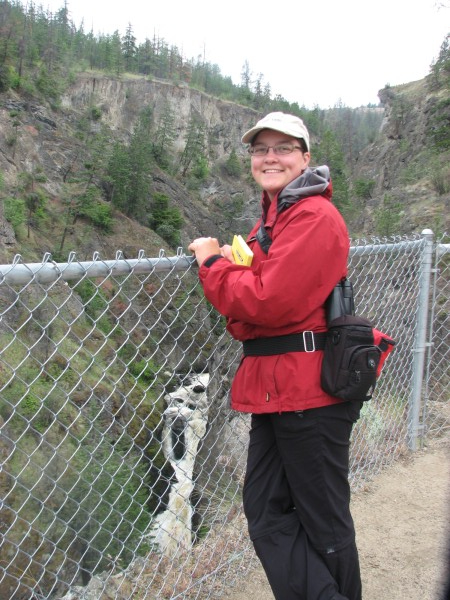

Brandon, Manitoba  
Canada, R7A3C4

__Phone:__ 204-717-1720  
__Email:__ [sel@steffilazerte.ca](mailto:sel@steffilazerte.ca)   
__Twitter:__ [@steffilazerte](http://twitter.com/steffilazerte)

__ResearchGate:__ <http://www.researchgate.net/profile/Stefanie_LaZerte>  
__ORCID:__ <http://orcid.org/0000-0002-7690-8360>   
__GitHub:__ <https://github.com/steffilazerte>  

-----

Born and bred in Muskoka, Ontario I am a [consulting biologist and R programmer](R.html). I teach R, handle data management in R and develop R packages for a variety of disciplines in the Natural Sciences.

Beyond R, I'm a [behavioural ecologist](cv.html#education) with an interest in how humans influence behaviour of animals and how citizen science projects can be used to do great science and engage the public.

I enjoy [teaching](cv.html#teaching) and [outreach](cv.html#teaching) and try to spread the love of R and make science more accessible.

Outside of research, I love travelling, be it camping locally or flying to visit exotic destinations. But I also enjoy stay-at-home activities such as reading, gardening and spinning wool into yarn.

> I was honoured to receive the Society of Canadian Ornithologists/Société des ornithologistes du Canada's inaugural **[Early Career Research Award](https://www.sco-soc.ca/copy-of-speirs-award)** for 2017
